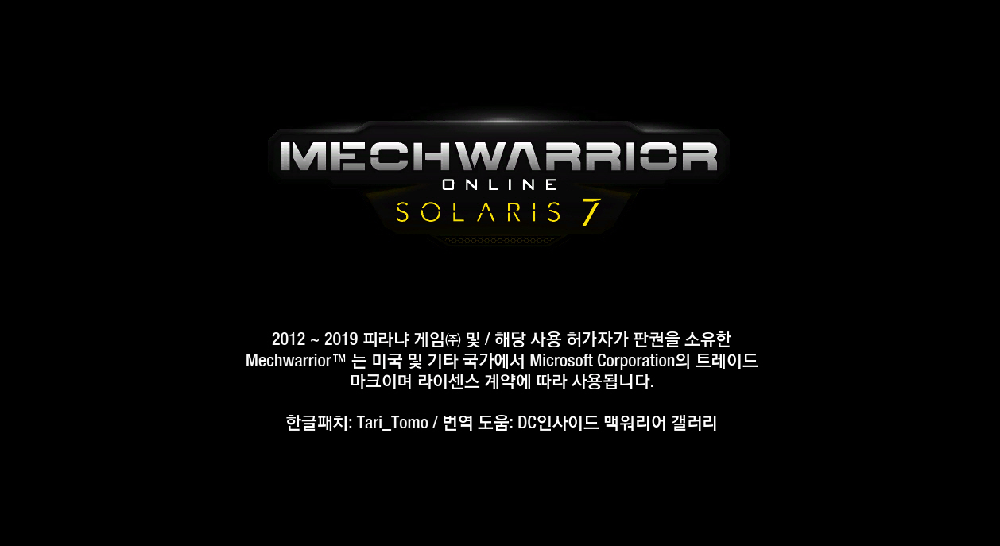
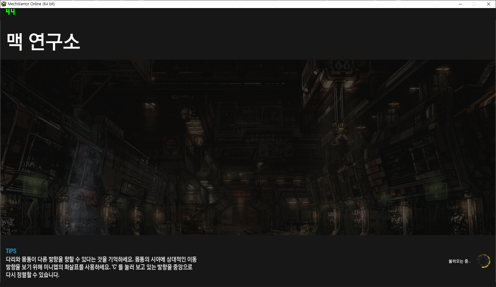
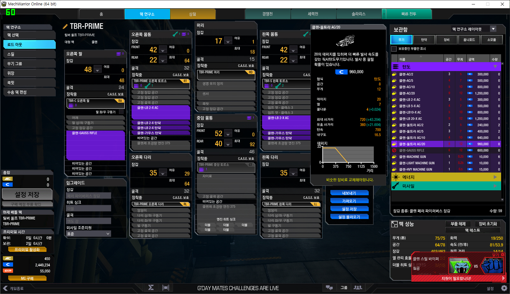
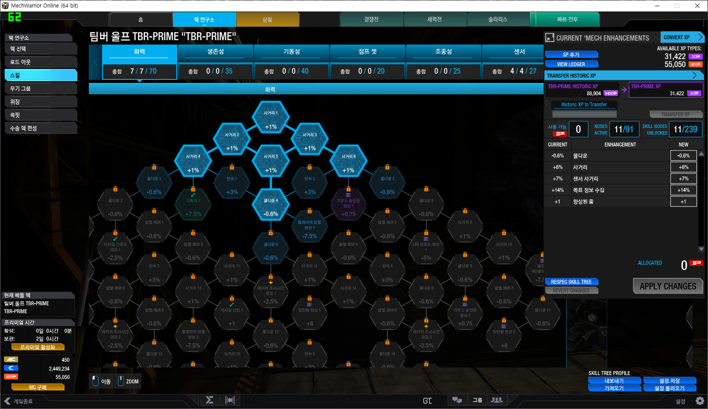
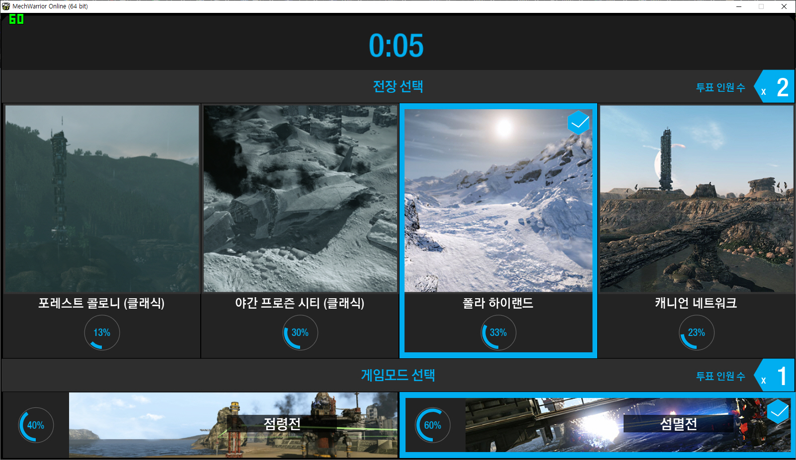
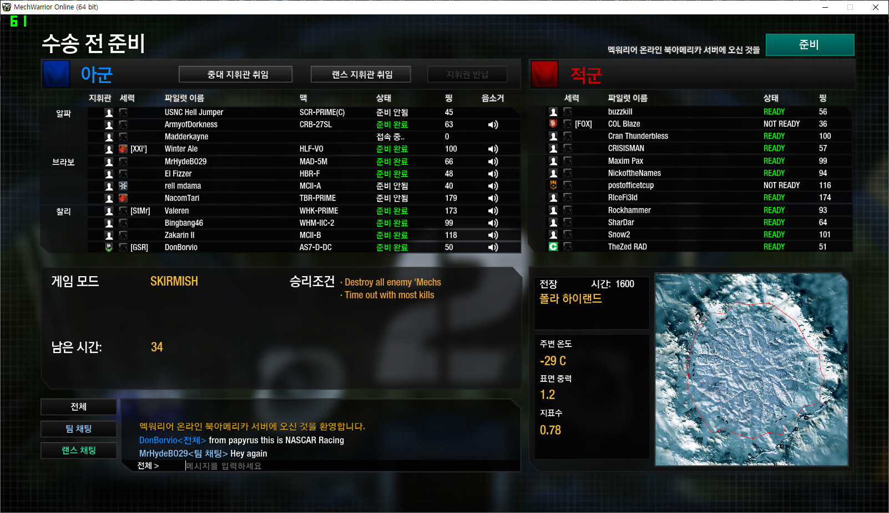
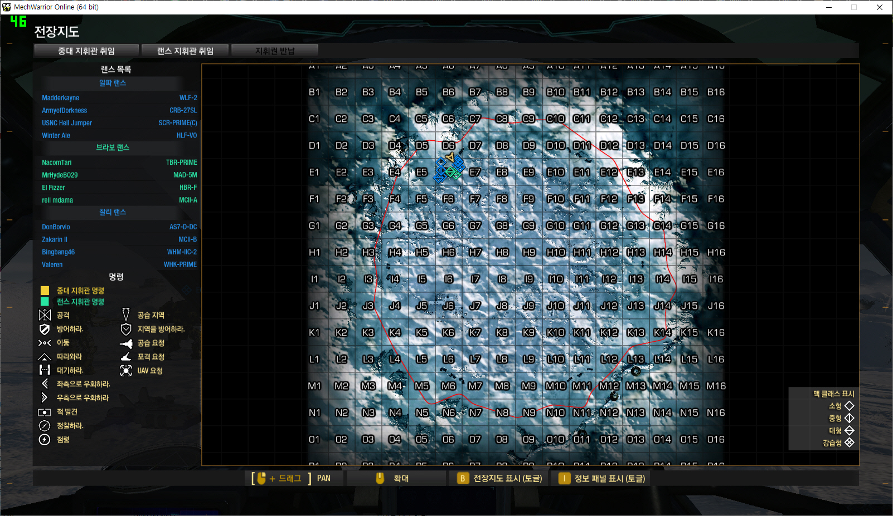
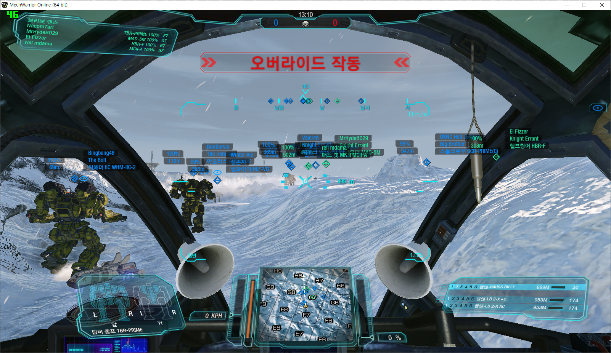
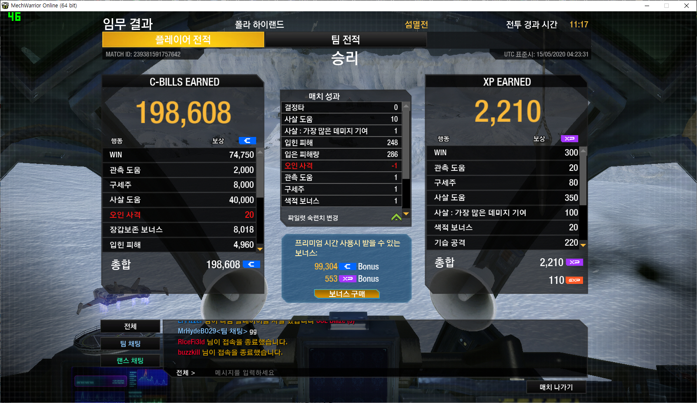

# 맥워리어 온라인 Steam PC 공식 한글 패치

[Steam - Tari_Tomo](https://steamcommunity.com/id/Tari_Tomo/)

[맥워리어 온라인(Steam, PC)](https://store.steampowered.com/app/342200/MechWarrior_Online_Solaris_7/)의 비공식 한글 패치입니다. 

~~#### 어디까지나 비공식 한글패치이므로 사용시 불이익은 책임지지 않습니다. 
#### 다만 타 국가 유저들도 자체적으로 현지어로 번역하여 게임을 즐기고 있다는 정보를 알려드립니다. 판단은 개인의 몫입니다. ~~

#### 피라냐 게임즈로부터 공식화 허가를 받게되었습니다!
#### 모든 한글화 참여멤버에게 감사의 인사를 드리며, 컨택에 도움을 주신 「배틀테크-맥워리어 갤러리」갤주님에게 감사의 말씀 드립니다!

### 현재 공개 테스트 및 공개 번역/검수로 전환하였습니다.

## 1. 테스트 패치 다운로드 및 적용방법

1. 아래 링크로 이동하여 테스트 패치 파일을 다운로드 합니다.
2. 맥워리어 온라인이 설치된 디렉터리 (일반적으로 `C:\Program Files (x86)\Steam\steamapps\common\MechWarrior Online`)로 이동합니다.
3. 현재 디렉터리에 `MWO-kor_Test_<버전>.zip` 파일의 압축 내용을 풀어 덮어 씌웁니다. (최신버전: 0.9.4)

[멕워리어 온라인 비공식 한글패치 다운로드](https://drive.google.com/drive/folders/1hhbO5I1WAQqMA3TCQ2tw9l925lu7T4Fu?usp=sharing)

## 2. 번역/검수 및 피드백은 어디에서 할 수 있나요?
・디시인사이드 배틀테크-맥워리어 마이너 갤러리를 참고하셔서 번역/검수에 참여하거나 피드백을 남겨주세요! 
・비공식 한글 패치인만큼 여러분들의 도움이 절실합니다! 
### 「게임이 버전업 됨에 따라 번역문도 추가 예정입니다.」

## 3. 패치 후 로그인 중 게임이 튕겨요!

1. 스팀 내게임 목록에 있는 맥워리어 온라인을 오른클릭하여 속성을 클릭.
2. 로컬파일 탭으로 가서 `게임 파일 무결성 확인...`을 클릭하여 최신버전으로 갱신합니다.
3. 한글 패치를 다시 진행합니다.

## 4. 한글이 거슬려요. 원상복구 하고싶어요!

1. 맥워리어 온라인이 설치된 디렉터리 (일반적으로 `C:\Program Files (x86)\Steam\steamapps\common\MechWarrior Online`)로 이동합니다.
2. system.cfg 파일을 메모장으로 연 뒤 내용을 전부 삭제 후 저장해주세요.
3. `\Game\Localized` 폴더 내 `Korean.pak` 파일을 삭제해주세요.

## 스크린샷

## License

본 프로젝트는 [MIT License](./LICENSE) 하에 제공됩니다.
