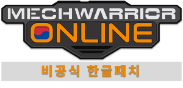

# 맥워리어 온라인 Steam PC 비공식 한글 패치

[맥워리어 온라인(Steam, PC)](https://store.steampowered.com/app/342200/MechWarrior_Online_Solaris_7/)의 비공식 한글 패치입니다. 

#### 어디까지나 비공식 한글패치이므로 사용시 불이익은 책임지지 않습니다. 
#### 다만 타 국가 유저들도 자체적으로 현지어로 번역하여 게임을 즐기고 있다는 정보를 알려드립니다. 판단은 개인의 몫입니다. 
### 현재 공개 테스트 및 공개 번역/검수로 전환하였습니다.
## 테스트 패치 다운로드 및 적용방법

1. 아래 링크로 이동하여 테스트 패치 파일을 다운로드 합니다.
2. 맥워리어 온라인이 설치된 디렉터리 (일반적으로 `C:\Program Files (x86)\Steam\steamapps\common\MechWarrior Online`)로 이동합니다.
3. 현재 디렉터리에 `MWO-kor_Test_<버전>.zip` 파일의 압축 내용을 풀어 덮어 씌웁니다.

## 번역/검수 및 피드백은 어디에서 할 수 있나요?
・디시인사이드 배틀테크-맥워리어 마이너 갤러리를 참고하셔서 번역/검수에 참여하거나 피드백을 남겨주세요! 
・비공식 한글 패치인만큼 여러분들의 도움이 절실합니다! 
### 「패치 파일은 매주 토요일에 최신 번역 파일로 갱신됩니다.」

## 패치 후 로그인중 게임이 튕겨요!

1. 스팀 내게임 목록에 있는 맥워리어 온라인을 오른클릭하여 속성을 클릭.
2. 로컬파일 탭으로 가서 `게임 파일 무결성 확인...`을 클릭하여 최신버전으로 갱신합니다.
3. 한글 패치를 다시 진행합니다.

## 한글이 거슬려요. 원상복구 하고싶어요!

1. 맥워리어 온라인이 설치된 디렉터리 (일반적으로 `C:\Program Files (x86)\Steam\steamapps\common\MechWarrior Online`)로 이동합니다.
2. system.cfg 파일을 메모장으로 연 뒤 내용을 전부 삭제 후 저장해주세요.
3. `\Game\Localized` 폴더 내 `Korean.pak` 파일을 삭제해주세요.

## 스크린샷

## License

본 프로젝트는 [MIT License](./LICENSE) 하에 제공됩니다.
